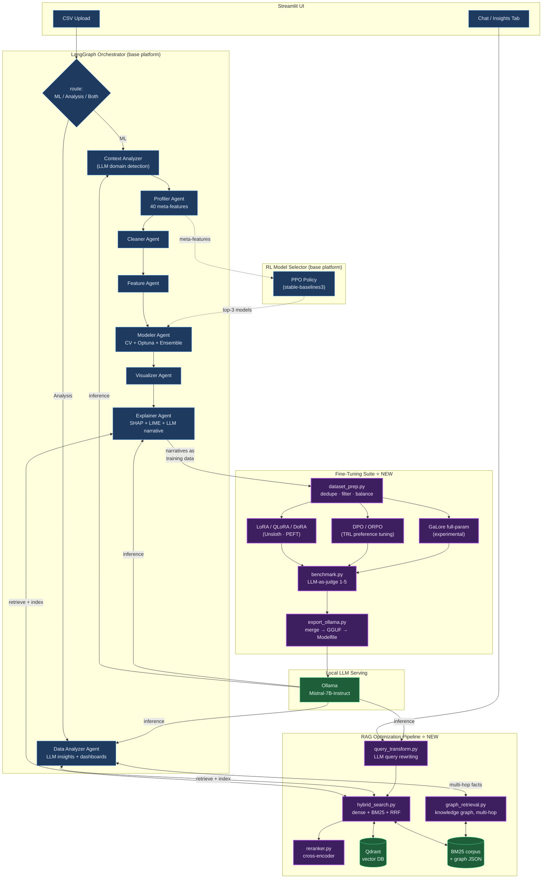

# DataPilot AI Pro

**Autonomous Data Science Platform with LLM Fine-Tuning & RAG Optimization** — Upload a CSV, get ML models, explainability, and business insights automatically. All LLM inference runs **locally via Ollama (Mistral-7B-Instruct)** — no paid APIs, no API keys.

> **Attribution:** The base platform (agents, UI, orchestration, RL selector) was built collaboratively with teammates.
> The **fine-tuning experiment suite (`finetuning/`) and RAG optimization pipeline (`rag/`) below were built independently.**

---

## Features

| Feature | Description |
|---------|-------------|
| **AutoML Pipeline** | Profiling → Cleaning → Feature Engineering → RL-powered Model Selection → Ensemble Training → SHAP/LIME Explanations |
| **Data Analyzer** | LLM-powered business intelligence — auto-discovers insights with interactive Plotly dashboards |
| **Explainability** | SHAP global/local importance, LIME explanations, AI-generated narratives |
| **RL Model Selector** | PPO agent trained on real OpenML datasets to recommend the best algorithm |
| **LangGraph Orchestrator** | Full pipeline coordination with conditional routing between ML and analysis modes |
| **Fine-Tuning Suite** ⭐ | LoRA / QLoRA / DoRA / DPO / ORPO / GaLore experiments training Mistral-7B to write plain-English model explanations, with dataset optimization, benchmark harness (LLM-as-judge), and GGUF→Ollama export |
| **RAG Optimization** ⭐ | Hybrid retrieval (Qdrant dense + BM25 sparse + RRF), cross-encoder reranking, LLM query rewriting for chat, and a knowledge graph for multi-hop questions — wired into the Explainer and Data Analyzer agents |

⭐ = built independently on top of the base platform.

---

## Architecture



Blue = original base platform (built with teammates) · Purple = fine-tuning + RAG work (built independently) · Green = local infrastructure.

---

## Quick Start

### Option A — Local Development

```bash
# 1. Install dependencies
pip install -r requirements.txt

# 2. Start infrastructure (Postgres, Redis, Qdrant, Ollama)
docker-compose up -d

# 3. Pull the LLM model (local, no API key)
docker exec datapilot-ollama ollama pull mistral:7b-instruct

# 4. (Optional) Train RL model selector on real data
python -m rl_selector.train --collect --n_datasets 30 --task classification --timesteps 50000

# 5. Run the UI
streamlit run ui/app.py
```

### Option B — Docker (Production)

```bash
docker compose -f docker-compose.prod.yml up --build -d
```

Open http://localhost:8501.

### Fine-tuning experiments (GPU required)

```bash
pip install -r finetuning/requirements-finetuning.txt
python -m finetuning.dataset_prep --n-synthetic 800 --use-ollama
python -m finetuning.finetune_qlora            # or lora / dora / dpo / orpo / galore
python -m finetuning.benchmark
python -m finetuning.export_ollama --technique qlora
# then set OLLAMA_MODEL=datapilot-explainer in .env
```

See [finetuning/README.md](finetuning/README.md) for the full experiment guide.

---

## Project Structure

```
├── agents/                # 7 pipeline agents (base platform)
│   ├── base.py            #   BaseAgent ABC — local Ollama LLM (Mistral-7B)
│   ├── profiler.py        #   Types, stats, quality score, 40 meta-features
│   ├── cleaner.py         #   Missing values, outliers, duplicates
│   ├── feature.py         #   Encoding, scaling, VIF, feature selection
│   ├── modeler.py         #   RL-guided training + Optuna + ensemble
│   ├── visualizer.py      #   19 chart types across 4 groups
│   ├── explainer.py       #   SHAP + LIME + RAG-augmented LLM narratives
│   └── data_analyzer.py   #   LLM business insights + RAG-augmented chat
├── orchestrator/          # LangGraph StateGraph (8 nodes, conditional routing)
├── rl_selector/           # PPO model selection (env, training, inference)
├── finetuning/            # ⭐ Fine-tuning experiment suite (independent work)
│   ├── dataset_prep.py    #   Dataset build + optimization (dedupe/filter/balance)
│   ├── finetune_lora.py   #   LoRA via Unsloth (16-bit base)
│   ├── finetune_qlora.py  #   QLoRA via Unsloth (4-bit NF4, consumer GPU)
│   ├── finetune_dora.py   #   DoRA via PEFT (weight decomposition)
│   ├── finetune_dpo.py    #   DPO preference tuning via TRL
│   ├── finetune_orpo.py   #   ORPO one-stage SFT+preference via TRL
│   ├── finetune_galore.py #   GaLore full-parameter (experimental)
│   ├── benchmark.py       #   Adapter comparison + LLM-as-judge scoring
│   └── export_ollama.py   #   Merge → GGUF → Modelfile → ollama create
├── rag/                   # ⭐ RAG optimization pipeline (independent work)
│   ├── embeddings.py      #   Local MiniLM embedder (384-dim)
│   ├── indexer.py         #   Qdrant + BM25 corpus mirror, idempotent ingestion
│   ├── hybrid_search.py   #   Dense + sparse retrieval fused with RRF
│   ├── reranker.py        #   Cross-encoder rerank (retrieve-then-rerank)
│   ├── query_transform.py #   LLM query rewriting for vague/multi-turn chat
│   └── graph_retrieval.py #   Knowledge graph for multi-hop questions
├── ui/                    # Streamlit web interface
├── benchmark/             # PPO vs AutoML benchmark harness (base platform)
├── datasets/              # Cached OpenML benchmark datasets
├── utils/config.py        # Config dataclass (Ollama-first)
├── api/, db/, tasks/      # Reserved stubs for FastAPI/DB/Celery (not implemented)
└── docker-compose*.yml    # Postgres, Redis, Qdrant, Ollama
```

---

## Environment Variables

| Variable | Default | Description |
|----------|---------|-------------|
| `OLLAMA_BASE_URL` | `http://localhost:11434` | Local Ollama LLM server |
| `OLLAMA_MODEL` | `mistral:7b-instruct` | LLM model (use `datapilot-explainer` after fine-tuning export) |
| `QDRANT_URL` | `http://localhost:6333` | Qdrant vector DB (RAG dense index) |
| `RAG_EMBEDDING_MODEL` | `sentence-transformers/all-MiniLM-L6-v2` | Local embedding model |
| `RAG_RERANKER_MODEL` | `cross-encoder/ms-marco-MiniLM-L-6-v2` | Local reranker |
| `DATABASE_URL` | `postgresql://…localhost:5432/datapilot` | PostgreSQL connection |
| `REDIS_URL` | `redis://localhost:6379` | Redis connection |
| `CV_FOLDS` | `5` | Cross-validation folds |
| `PPO_MODEL_PATH` | `./rl_selector/models` | RL model path |
| `GEMINI_API_KEY` / `GROQ_API_KEY` | *(blank)* | Optional legacy cloud fallbacks — leave blank for fully local |

---

## Tech Stack

- **ML**: scikit-learn, XGBoost, LightGBM, CatBoost, Optuna
- **RL**: stable-baselines3 (PPO), Gymnasium, PyTorch
- **LLM serving**: Ollama (Mistral-7B-Instruct, local, no API keys)
- **Fine-tuning**: Unsloth, PEFT (LoRA/DoRA), TRL (DPO/ORPO), GaLore, bitsandbytes, GGUF/llama.cpp
- **RAG**: Qdrant, sentence-transformers (MiniLM + cross-encoder), rank-bm25, Reciprocal Rank Fusion
- **Orchestration**: LangChain, LangGraph
- **Explainability**: SHAP, LIME
- **Visualization**: Plotly, Matplotlib, Seaborn
- **Infrastructure**: PostgreSQL, Redis, Qdrant, Ollama, Docker
- **Frontend**: Streamlit
